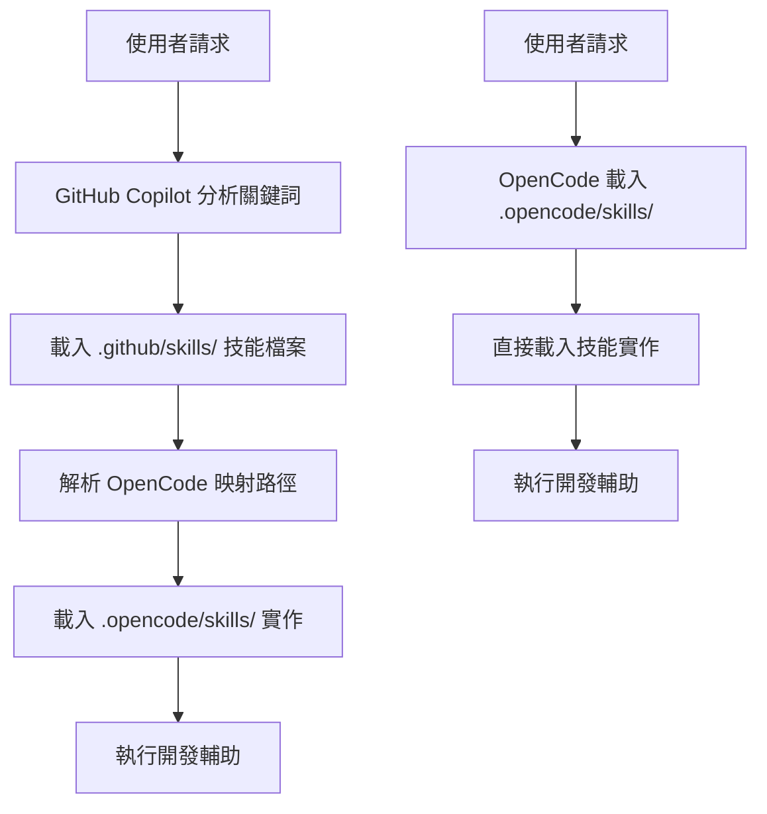

# GitHub Copilot Skills 雙向映射配置

## 🔗 雙向映射系統

### 結構對應

```
Lucky50/
├── .github/skills/           # GitHub Copilot 技能入口
│   ├── agent.md          → ../../.opencode/skills/agent.md
│   ├── code-standards.md  → ../../.opencode/skills/code-standards/SKILL.md
│   ├── vue.md            → ../../.opencode/skills/vue/SKILL.md
│   ├── git-workflow.md   → ../../.opencode/skills/git-workflow/SKILL.md
│   ├── github-integration.md → ../../.opencode/skills/github/SKILL.md
│   ├── soft-routing.md    → ../../.opencode/skills/github/soft-routing.md
│   └── CONFIG.md         # 本配置檔案
└── .opencode/skills/         # OpenCode 技能實作庫
    ├── agent/
    ├── code-standards/
    ├── vue/
    ├── git-workflow/
    ├── github/
    └── agent.md
```

### 符號連結方式

```bash
# 使用相對路徑的符號連結
ln -s ../../.opencode/skills/agent.md .github/skills/agent.md
ln -s ../../.opencode/skills/code-standards/SKILL.md .github/skills/code-standards.md
ln -s ../../.opencode/skills/vue/SKILL.md .github/skills/vue.md
ln -s ../../.opencode/skills/git-workflow/SKILL.md .github/skills/git-workflow.md
ln -s ../../.opencode/skills/github/SKILL.md .github/skills/github-integration.md
ln -s ../../.opencode/skills/github/soft-routing.md .github/skills/soft-routing.md
```

## 📊 技能對應關係表

| GitHub Copilot 技能     | OpenCode 實作                              | 觸發關鍵詞                                      | 主要功能                                  | 映射類型    |
| ----------------------- | ------------------------------------------ | ----------------------------------------------- | ----------------------------------------- | ----------- |
| `agent.md`              | `.opencode/skills/agent.md`                | AI, agent, 智慧助理                             | AI 功能總覽、技能整合指引                 | 📁 直接映射 |
| `code-standards.md`     | `.opencode/skills/code-standards/SKILL.md` | code-standards, coding, development, 規範, 開發 | 程式碼規範、技術棧標準、開發最佳實踐      | 📁 直接映射 |
| `vue.md`                | `.opencode/skills/vue/SKILL.md`            | vue, component, composable, composition         | Vue 3 開發指南、Composition API、測試實踐 | 📁 直接映射 |
| `git-workflow.md`       | `.opencode/skills/git-workflow/SKILL.md`   | git, commit, branch, workflow, pr               | Git 分支管理、提交規範、工作流程          | 📁 直接映射 |
| `github-integration.md` | `.opencode/skills/github/`                 | github, copilot, skill, integration             | GitHub Copilot 整合、README 維護機制      | 📁 直接映射 |
| `soft-routing.md`       | `.opencode/skills/github/soft-routing.md`  | routing, 智能, 觸發, 載入, 決策樹               | 智慧路由機制、觸發詞識別、技能組合        | 📁 直接映射 |
| `CONFIG.md`             | 配置說明                                   | config, mapping, 設定, 雙向                     | 系統配置、映射關係、使用指南              | 📋 元數據   |

## 🤖 GitHub Copilot 自動載入機制

### 雙向同步優勢

1. **單一維護點**：只需維護 `.opencode/skills/` 實作
2. **自動同步**：GitHub Copilot 和 OpenCode 都會載入相同內容
3. **版本一致性**：確保兩個 AI 系統使用相同版本的技能
4. **性能優化**：避免重複檔案和內容不一致

### 載入流程



## 🎯 觸發關鍵詞系統

### 單一技能觸發

```bash
# Vue 開發
"建立一個組件" → vue.md
"Vue component" → vue.md
"寫 composable" → vue.md
```

### 多技能組合觸發

```bash
# 複雜請求
"建立一個使用者認證組件並更新文檔" → vue.md + github-integration.md
"提交變更並檢查規範" → git-workflow.md + code-standards.md
"重構 Vue 代碼並測試" → vue.md + code-standards.md
```

### 智慧情境感知

```bash
# 根據檔案位置自動觸發
# 編輯 .vue 檔案 → 自動載入 vue.md + code-standards.md
# 執行 git 命令 → 自動載入 git-workflow.md
# 編輯 README.md → 自動載入 github-integration.md
```

## 🔧 實作方式

### 方式一：符號連結（推薦）

```bash
# 建立符號連結
cd .github/skills
ln -s ../../.opencode/skills/agent.md .
ln -s ../../.opencode/skills/code-standards/SKILL.md ./code-standards.md
ln -s ../../.opencode/skills/vue/SKILL.md ./vue.md
ln -s ../../.opencode/skills/git-workflow/SKILL.md ./git-workflow.md
ln -s ../../.opencode/skills/github/SKILL.md ./github-integration.md
ln -s ../../.opencode/skills/github/soft-routing.md ./soft-routing.md
```

### 方式二：相對路徑引用

在每個 `.github/skills/*.md` 中明確指定相對路徑

### 方式三：自動同步腳本

```bash
#!/bin/bash
# sync-skills.sh - 自動同步腳本
echo "🔄 同步 GitHub Copilot 技能到 OpenCode..."
# 執行符號連結建立
# 驗證映射關係
```

## 📋 配置驗證

### 映射完整性檢查

```bash
# 檢查所有映射是否有效
for file in .github/skills/*.md; do
  echo "檢查: $file"
  # 驗證映射路徑是否存在
done
```

### 技能載入測試

```bash
# 測試觸發關鍵詞
echo "測試 Vue 技能載入..."
# 應該載入 vue.md 和對應的 code-standards.md
```

---

**這個雙向映射系統確保了 GitHub Copilot 和 OpenCode 的完美整合，提供了單一維護點和最佳的開發體驗！**
