# GitHub Copilot Skills 軟路由共享機制

## 🔄 軟路由共享系統

本專案採用了**軟路由共享機制**，讓 OpenCode 和 GitHub Copilot 兩個 AI 系統共享同一套技能庫，避免重複維護。

### 🏗️ 雙向架構設計

```
Lucky50/
├── .github/skills/              # GitHub Copilot Agent Skills
│   ├── agent.md              → ../../.opencode/skills/agent.md
│   ├── code-standards.md     → ../../.opencode/skills/code-standards/SKILL.md
│   ├── vue.md               → ../../.opencode/skills/vue/SKILL.md
│   ├── git-workflow.md      → ../../.opencode/skills/git-workflow/SKILL.md
│   ├── github-integration.md → ../../.opencode/skills/github/SKILL.md
│   ├── soft-routing.md      → ../../.opencode/skills/github/soft-routing.md
│   └── CONFIG.md            # 本配置檔案
│
├── .opencode/skills/             # OpenCode Agent Skills（主要維護點）
│   ├── agent.md             ← ../../.github/skills/agent.md
│   ├── code-standards/      ← ../../.github/skills/code-standards.md
│   │   ├── SKILL.md        # 主要技能文檔
│   │   └── references/     # 詳細參考文檔
│   │       ├── api.md
│   │       ├── components.md
│   │       ├── composables.md
│   │       ├── error-handling.md
│   │       ├── chartjs.md
│   │       └── threejs.md
│   ├── vue/                ← ../../.github/skills/vue.md
│   │   └── SKILL.md
│   ├── git-workflow/       ← ../../.github/skills/git-workflow.md
│   │   └── SKILL.md
│   ├── github/             ← ../../.github/skills/github-integration.md
│   │   ├── SKILL.md
│   │   └── soft-routing.md ← ../../.github/skills/soft-routing.md
│   └── soft-routing.md     → ../../.opencode/skills/github/soft-routing.md
│
└── 符號連結實現雙向同步
```

### 🛠️ 實作方式

#### 符號連結配置（軟路由實現）

```bash
# GitHub Copilot Skills → OpenCode Skills（主要方向）
cd .github/skills
ln -s ../../.opencode/skills/agent.md ./agent.md
ln -s ../../.opencode/skills/code-standards/SKILL.md ./code-standards.md
ln -s ../../.opencode/skills/vue/SKILL.md ./vue.md
ln -s ../../.opencode/skills/git-workflow/SKILL.md ./git-workflow.md
ln -s ../../.opencode/skills/github/SKILL.md ./github-integration.md
ln -s ../../.opencode/skills/github/soft-routing.md ./soft-routing.md

# OpenCode Skills ← GitHub Copilot Skills（反向同步）
cd .opencode/skills
ln -s ../../.github/skills/agent.md ./agent.md
ln -s ../../.github/skills/soft-routing.md ./github/soft-routing.md
```

#### 雙向同步優勢

✅ **單一維護點**：只需維護 `.opencode/skills/` 實作
✅ **自動同步**：GitHub Copilot 和 OpenCode 都會載入相同內容
✅ **版本一致性**：確保兩個 AI 系統使用相同版本的技能
✅ **性能優化**：避免重複檔案和內容不一致
✅ **開發體驗**：無縫整合，無需手動同步

## 📊 技能對應關係表

| GitHub Copilot 技能     | OpenCode 實作                              | 觸發關鍵詞                                      | 主要功能                                  | 映射類型    |
| ----------------------- | ------------------------------------------ | ----------------------------------------------- | ----------------------------------------- | ----------- |
| `agent.md`              | `.opencode/skills/agent.md`                | AI, agent, 智慧助理                             | AI 功能總覽、技能整合指引                 | 📁 直接映射 |
| `code-standards.md`     | `.opencode/skills/code-standards/SKILL.md` | code-standards, coding, development, 規範, 開發 | 程式碼規範、技術棧標準、開發最佳實踐      | 📁 直接映射 |
| `vue.md`                | `.opencode/skills/vue/SKILL.md`            | vue, component, composable, composition         | Vue 3 開發指南、Composition API、測試實踐 | 📁 直接映射 |
| `git-workflow.md`       | `.opencode/skills/git-workflow/SKILL.md`   | git, commit, branch, workflow, pr               | Git 分支管理、提交規範、工作流程          | 📁 直接映射 |
| `github-integration.md` | `.opencode/skills/github/`                 | github, copilot, skill, integration             | GitHub Copilot 整合、README 維護機制      | 📁 直接映射 |
| `soft-routing.md`       | `.opencode/skills/github/soft-routing.md`  | routing, 智能, 觸發, 載入, 決策樹               | 智慧路由機制、觸發詞識別、技能組合        | 📁 直接映射 |
| `CONFIG.md`             | 配置說明                                   | config, mapping, 設定, 雙向                     | 系統配置、映射關係、使用指南              | 📋 元數據   |

## 🤖 AI 系統載入機制

### 🔄 雙向載入流程

```mermaid
graph TD
    A[使用者請求] --> B[GitHub Copilot 分析關鍵詞]
    B --> C[載入 .github/skills/ 技能檔案]
    C --> D[解析符號連結]
    D --> E[載入 .opencode/skills/ 實作]
    E --> F[執行開發輔助]

    G[使用者請求] --> H[OpenCode 載入 .opencode/skills/]
    H --> I[直接載入技能實作]
    I --> J[執行開發輔助]

    style C fill:#e1f5fe
    style D fill:#f3e5f5
    style E fill:#e8f5e8
    style H fill:#e1f5fe
    style I fill:#e8f5e8
```



### 🎯 如何使用 Agent Skills

#### GitHub Copilot 使用者

- GitHub Copilot 會自動偵測 `.github/skills/` 目錄中的技能
- 在相關開發任務中，Copilot 會自動載入對應的技能指南
- 支援 VS Code、Copilot CLI 和 GitHub.com 中的 agent 模式

#### OpenCode AI 使用者

- OpenCode 會自動載入專案中的 skills
- 在對話中提及相關主題時，AI 會自動參考對應的 skill
- 可透過 skill 指令直接載入特定技能

## 🎯 觸發關鍵詞系統

### 單一技能觸發

```bash
# Vue 開發
"建立一個組件" → vue.md
"Vue component" → vue.md
"寫 composable" → vue.md
```

### 多技能組合觸發

```bash
# 複雜請求
"建立一個使用者認證組件並更新文檔" → vue.md + github-integration.md
"提交變更並檢查規範" → git-workflow.md + code-standards.md
"重構 Vue 代碼並測試" → vue.md + code-standards.md
```

### 智慧情境感知

```bash
# 根據檔案位置自動觸發
# 編輯 .vue 檔案 → 自動載入 vue.md + code-standards.md
# 執行 git 命令 → 自動載入 git-workflow.md
# 編輯 README.md → 自動載入 github-integration.md
# 處理農民曆相關 → 自動載入 code-standards.md + references/api.md
# 開發投資圖表 → 自動載入 vue.md + references/chartjs.md + references/components.md
```

## 🎯 Lucky50 專案特化觸發

### 業務場景技能組合

```bash
# 農民曆功能開發
"建立農民曆日期選擇器" → vue.md + code-standards.md + references/components.md
"實作農民曆 API 服務" → code-standards.md + references/api.md + references/composables.md
"添加吉時宜忌計算" → code-standards.md + references/composables.md

# 投資分析功能開發
"建立股價走勢圖表" → vue.md + references/chartjs.md + references/components.md
"實作技術指標計算" → code-standards.md + references/api.md + references/composables.md
"添加投資推薦系統" → vue.md + code-standards.md + references/composables.md

# 跨功能整合
"農民曆與投資時機分析" → vue.md + code-standards.md + references/api.md + references/chartjs.md
"用戶偏好設定系統" → vue.md + code-standards.md + references/composables.md
```

## 🔧 實作方式

### 方式一：符號連結（推薦）

```bash
# 建立符號連結
cd .github/skills
ln -s ../../.opencode/skills/agent.md .
ln -s ../../.opencode/skills/code-standards/SKILL.md ./code-standards.md
ln -s ../../.opencode/skills/vue/SKILL.md ./vue.md
ln -s ../../.opencode/skills/git-workflow/SKILL.md ./git-workflow.md
ln -s ../../.opencode/skills/github/SKILL.md ./github-integration.md
ln -s ../../.opencode/skills/github/soft-routing.md ./soft-routing.md
```

### 方式二：相對路徑引用

在每個 `.github/skills/*.md` 中明確指定相對路徑

### 方式三：自動同步腳本

```bash
#!/bin/bash
# sync-skills.sh - 自動同步腳本
echo "🔄 同步 GitHub Copilot 技能到 OpenCode..."
# 執行符號連結建立
# 驗證映射關係
```

## 📋 配置驗證

### 映射完整性檢查

```bash
# 檢查所有映射是否有效
for file in .github/skills/*.md; do
  echo "檢查: $file"
  # 驗證映射路徑是否存在
done
```

### 技能載入測試

```bash
# 測試觸發關鍵詞
echo "測試 Vue 技能載入..."
# 應該載入 vue.md 和對應的 code-standards.md
```

---

**這個雙向映射系統確保了 GitHub Copilot 和 OpenCode 的完美整合，提供了單一維護點和最佳的開發體驗！**
