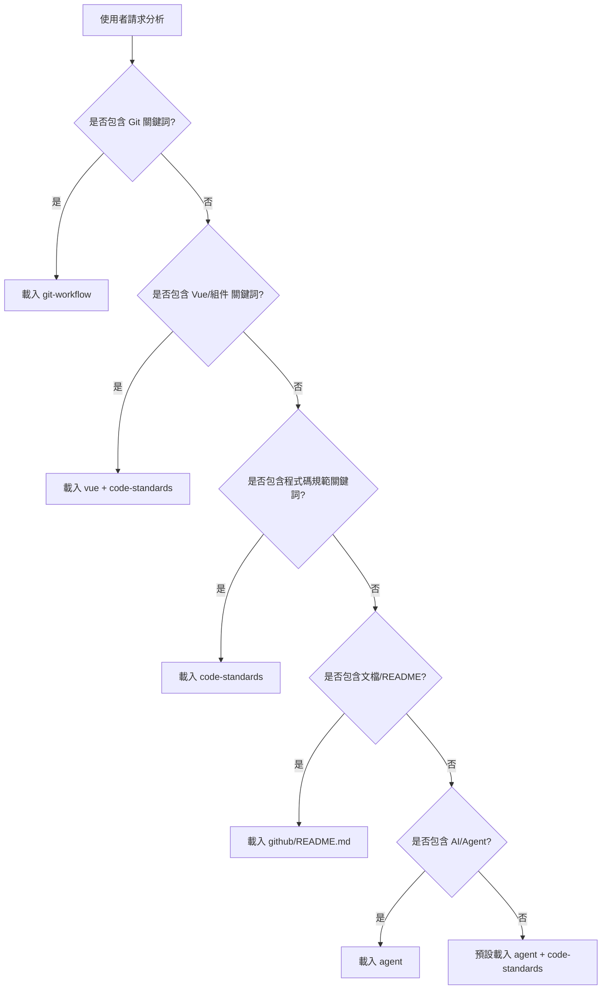

# GitHub Copilot 軟路由機制

## 🎯 智慧載入系統

GitHub Copilot 根據使用者請求內容，自動載入最適合的技能組合。

### 路由決策樹



### 詳細觸發詞映射

#### 🔄 Git 工作流程

| 使用者請求範例                    | 載入技能                            | 功能                    |
| --------------------------------- | ----------------------------------- | ----------------------- |
| 「幫我提交這次變更」              | `git-workflow` + `github/README.md` | Git 規範 + README 維護  |
| 「建立新分支 feature/user-login」 | `git-workflow`                      | 分支命名規範            |
| 「檢查我的 commit 訊息」          | `git-workflow`                      | Commit 訊息規範         |
| 「如何處理 merge conflict」       | `git-workflow` + `code-standards`   | Git 工作流程 + 開發規範 |

#### 🎨 Vue 3 開發

| 使用者請求範例             | 載入技能                             | 功能                           |
| -------------------------- | ------------------------------------ | ------------------------------ |
| 「建立一個使用者認證組件」 | `vue` + `code-standards`             | Vue 組件模式 + 專案規範        |
| 「重構這個 composable」    | `vue/composables` + `code-standards` | Composable 規範 + 重構最佳實踐 |
| 「修復響應式問題」         | `vue` + `code-standards`             | Vue 響應式模式                 |
| 「新增測試到這個組件」     | `vue/testing` + `code-standards`     | 測試規範 + 專案標準            |

#### 🏗️ 程式碼規範

| 使用者請求範例               | 載入技能         | 功能           |
| ---------------------------- | ---------------- | -------------- |
| 「檢查我的代碼是否符合規範」 | `code-standards` | 完整規範檢查   |
| 「新增 Pinia Store」         | `code-standards` | Store 開發規範 |
| 「整合 Three.js 視覺化」     | `code-standards` | 3D 開發規範    |
| 「處理 API 錯誤」            | `code-standards` | 錯誤處理規範   |

#### 📋 文檔維護

| 使用者請求範例     | 載入技能                              | 功能         |
| ------------------ | ------------------------------------- | ------------ |
| 「更新 README.md」 | `github/README.md`                    | 強制維護機制 |
| 「新增 API 文檔」  | `github/README.md` + `code-standards` | 文檔更新流程 |
| 「檢查文檔格式」   | `github/README.md`                    | 文檔驗證標準 |

#### 🤖 AI 功能說明

| 使用者請求範例                | 載入技能                        | 功能         |
| ----------------------------- | ------------------------------- | ------------ |
| 「GitHub Copilot 如何運作？」 | `agent`                         | AI 功能總覽  |
| 「如何配置自訂技能？」        | `agent` + `github`              | 技能開發指南 |
| 「軟路由機制說明」            | `agent` + `github/soft-routing` | 詳細路由說明 |

## 🔧 高階路由策略

### 多技能組合載入

**基於複雜度的動態載入：**

```typescript
// 虛擬的 GitHub Copilot 路由邏輯
function determineSkills(request: string): Skill[] {
  const keywords = extractKeywords(request)
  const complexity = assessComplexity(request)

  const baseSkills: Skill[] = []

  // 基礎技能判斷
  if (keywords.includes('vue') || keywords.includes('component')) {
    baseSkills.push('vue')
  }

  if (keywords.includes('git') || keywords.includes('commit')) {
    baseSkills.push('git-workflow')
  }

  if (keywords.includes('code') || keywords.includes('standard')) {
    baseSkills.push('code-standards')
  }

  // 複雜度增強
  if (complexity >= 0.7) {
    baseSkills.push('agent') // 複雜任務需要 AI 指引
  }

  if (keywords.includes('documentation') || keywords.includes('readme')) {
    baseSkills.push('github/README.md')
  }

  return baseSkills
}
```

### 情境感知載入

**基於專案狀態的智慧載入：**

```typescript
// 考慮當前專案狀態
function contextualLoad(request: string, projectState: ProjectState): Skill[] {
  const skills = determineSkills(request)

  // 如果剛提交了代碼，強制載入文檔維護
  if (projectState.hasRecentCommits && !projectState.hasRecentDocUpdates) {
    skills.push('github/README.md')
  }

  // 如果在 main 分支，強制載入 Git 工作流程
  if (projectState.currentBranch === 'main') {
    skills.unshift('git-workflow') // 高優先級
  }

  return skills
}
```

## 📊 載入效能最佳化

### Context 使用策略

**避免 Context 浪費：**

| 技能類型           | 基礎 Token | 參考檔案      | 載入策略                  |
| ------------------ | ---------- | ------------- | ------------------------- |
| `agent`            | 250 tokens | -             | 總是載入                  |
| `code-standards`   | 250 tokens | -             | 按需載入                  |
| `git-workflow`     | 150 tokens | -             | Git 相關請求載入          |
| `vue`              | 200 tokens | references/\* | Vue 相關請求 + 按模組載入 |
| `github/README.md` | 300 tokens | -             | 文檔相關請求載入          |

### 智慧載入優先級

1. **高優先級**（總是載入）：
   - `agent` - AI 功能基礎

2. **中優先級**（根據請求載入）：
   - `code-standards` - 程式碼規範
   - `git-workflow` - Git 工作流程

3. **選擇性載入**：
   - `vue/*` - 僅 Vue 開發時載入
   - `github/README.md` - 僅文檔操作時載入

## 🔍 除錯與監控

### 路由日誌

**GitHub Copilot 提供載入日誌**：

```bash
# 查看最近 10 次技能載入
copilot logs --skills --last 10

# 查看特定請求的載入詳情
copilot logs --request "建立使用者組件"
```

### 效能監控

**關鍵指標**：

- 載入時間（應 < 500ms）
- Token 使用量（應 < 2000 tokens）
- 技能命中率（應 > 80%）
- 使用者滿意度（主觀回饋）

## 🚀 進階功能

### 自學習路由

**機器學習優化**：

```typescript
// 基於使用者行為的最佳化
interface SkillUsageStats {
  userId: string
  request: string
  loadedSkills: string[]
  satisfaction: number // 1-5 rating
  suggestedSkills?: string[]
}

// 系統學習最佳技能組合
function optimizeRoute(stats: SkillUsageStats[]): RouteOptimization {
  // 分析成功模式
  // 識別技能關聯性
  // 預測最佳組合
}
```

### 個人化路由

**使用者偏好設定**：

```json
{
  "userId": "developer123",
  "preferences": {
    "preferredSkillOrder": ["code-standards", "vue", "git-workflow"],
    "verbosity": "detailed",
    "autoLoadDocumentation": true,
    "preferredLanguage": "zh-TW"
  }
}
```

---

**🎯 目標：讓 GitHub Copilot 成為您最聰明的開發助理！**
